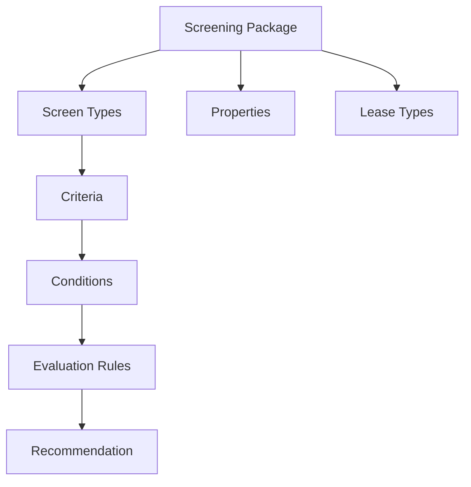
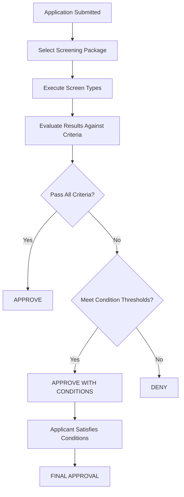

# Screening Packages, Conditions, and Criteria Documentation

## Table of Contents
1. [Overview](#overview)
2. [Screening Packages](#screening-packages)
3. [Screening Conditions](#screening-conditions)
4. [Screening Criteria](#screening-criteria)
5. [Business Logic Flow](#business-logic-flow)
6. [UI Components](#ui-components)
7. [Code Examples](#code-examples)
8. [Best Practices](#best-practices)

## Overview

The screening system in Entrata is a comprehensive solution for evaluating rental applications. It consists of three main components:

- **Screening Packages**: Define what types of screening to perform
- **Screening Conditions**: Specify requirements that must be met
- **Screening Criteria**: Set the rules and thresholds for evaluation

### Key Concepts



## Screening Packages

### What is a Screening Package?

A screening package is a collection of screening types (credit, criminal, income verification, etc.) that are applied together to evaluate a rental application. Think of it as a "recipe" for what to check when screening an applicant.

### Package Structure

```php
// Example: CScreeningPackage class structure
class CScreeningPackage {
    private $id;
    private $name;                    // "Lease Holder - Package 1"
    private $screeningPackageTypeId;  // Package type (1-4)
    private $isActive;                // Whether package is active
    private $isUseForPrescreening;    // Enable tiered screening
    private $properties;              // Associated properties
    private $screenTypes;             // What to screen
}
```

### Package Types

1. **Standard Package** - Basic screening for regular applicants
2. **Corporate Package** - Enhanced screening for corporate clients
3. **Student Package** - Specialized screening for student housing
4. **Affordable Package** - Screening for affordable housing programs

### UI Example: Package List

```html
<!-- From packages.tpl -->
<table class="sort clickable">
    <tr>
        <th>Package Name</th>
        <th>Lease Type</th>
        <th>Associated Properties</th>
        <th>Last Update</th>
    </tr>
    <tr>
        <td>Lease Holder - Package 1</td>
        <td>New Lease, Renewal</td>
        <td>36</td>
        <td>11/23/2016</td>
    </tr>
</table>
```


### Creating a Package

```php
// Example: Creating a new screening package
$screeningPackage = new CScreeningPackage();
$screeningPackage->setName("Premium Screening Package");
$screeningPackage->setScreeningPackageTypeId(1);
$screeningPackage->setIsActive(true);

// Associate screen types
$screenTypes = [
    CScreenType::CREDIT,
    CScreenType::CRIMINAL,
    CScreenType::INCOME_VERIFICATION
];
$screeningPackage->setScreenTypes($screenTypes);
```

## Screening Conditions

### What are Screening Conditions?

Screening conditions are specific requirements that must be satisfied for an application to be approved. They can be financial (deposit amounts, rent increases) or procedural (guarantor requirements, document submission).

### Condition Types

1. **Financial Conditions**
   - Increase deposit amount
   - Increase rent amount
   - Additional fees

2. **Documentation Conditions**
   - Provide additional documents
   - Submit proof of income
   - Add guarantor

3. **Procedural Conditions**
   - Complete additional forms
   - Attend property tour
   - Provide references

### Condition Structure

```php
// Example: CScreeningPackageConditionSet class
class CScreeningPackageConditionSet {
    private $id;
    private $name;                    // "Pass with Conditions - Custom 1"
    private $screeningRecommendationTypeId; // PASS, FAIL, PASSWITHCONDITIONS
    private $operandTypeId;           // AND, OR logic
    private $conditionSubsets;        // Grouped conditions
    private $requiredItemsSubsetOne;  // How many from subset 1
    private $requiredItemsSubsetTwo;  // How many from subset 2
}
```

### UI Example: Condition Templates

```html
<!-- From view_screening_package_conditions.tpl -->
<table class="sort clickable">
    <tr>
        <th>Template Name</th>
        <th>Conditions</th>
        <th>Action</th>
    </tr>
    <tr>
        <td>Pass with Conditions - Custom 1</td>
        <td>
            <strong>Do ONE:</strong> Increase Deposit, Add Guarantor<br>
            OR<br>
            <strong>Do ALL:</strong> Increase Rent, Increase Income
        </td>
        <td><i class="copy" title="Duplicate"></i></td>
    </tr>
</table>
```


### Condition Logic

```php
// Example: Condition evaluation logic
public function evaluateConditions($conditionSets, $applicantData) {
    foreach ($conditionSets as $conditionSet) {
        $subsetOneSatisfied = 0;
        $subsetTwoSatisfied = 0;

        // Check subset one conditions
        foreach ($conditionSet->getSubsetOneConditions() as $condition) {
            if ($this->isConditionSatisfied($condition, $applicantData)) {
                $subsetOneSatisfied++;
            }
        }

        // Check subset two conditions
        foreach ($conditionSet->getSubsetTwoConditions() as $condition) {
            if ($this->isConditionSatisfied($condition, $applicantData)) {
                $subsetTwoSatisfied++;
            }
        }

        // Apply logic (AND/OR)
        if ($conditionSet->getOperandTypeId() == CScreeningPackageOperandType::AND) {
            $isSatisfied = ($subsetOneSatisfied >= $conditionSet->getRequiredItemsSubsetOne()
                           && $subsetTwoSatisfied >= $conditionSet->getRequiredItemsSubsetTwo());
        } else { // OR logic
            $isSatisfied = ($subsetOneSatisfied >= $conditionSet->getRequiredItemsSubsetOne()
                           || $subsetTwoSatisfied >= $conditionSet->getRequiredItemsSubsetTwo());
        }

        if ($isSatisfied) {
            return true;
        }
    }
    return false;
}
```

## Screening Criteria

### What are Screening Criteria?

Screening criteria define the specific rules and thresholds used to evaluate screening results. They determine what constitutes a "pass," "fail," or "pass with conditions" for each screening type.

### Criteria Types

1. **Credit Criteria**
   - Minimum credit score
   - Maximum debt-to-income ratio
   - Bankruptcy restrictions

2. **Criminal Criteria**
   - Felony restrictions
   - Misdemeanor allowances
   - Time-based restrictions

3. **Income Criteria**
   - Minimum income requirements
   - Income-to-rent ratios
   - Employment verification

### Criteria Structure

```php
// Example: CScreeningCriteria class
class CScreeningCriteria {
    private $id;
    private $name;                    // "Standard Credit Criteria"
    private $screenTypeId;            // CREDIT, CRIMINAL, etc.
    private $isPublished;             // Whether criteria is active
    private $settings;                // Specific criteria settings
    private $conditionSets;           // Associated condition sets
}
```

### UI Example: Criteria Templates

```html
<!-- From view_screening_package_criterias.tpl -->
<div class="sidetabs wide1">
    <div class="sidetabs-body">
        <div id="tab-content" class="criteria-tabs-content">
            <!-- Criteria content -->
        </div>
    </div>
    <ul class="sidetabs-menu">
        <li class="criteria-tabs" data-id="1">Credit</li>
        <li class="criteria-tabs" data-id="2">Criminal</li>
        <li class="criteria-tabs" data-id="3">Income</li>
    </ul>
</div>
```


### Criteria Evaluation

```php
// Example: Criteria evaluation logic
public function evaluateScreeningResult($screeningData, $criteria) {
    $recommendation = CScreeningRecommendationType::PASS;

    foreach ($criteria->getSettings() as $setting) {
        $value = $screeningData[$setting->getConfigPreferenceTypeId()];

        switch ($setting->getValueTypeId()) {
            case CScreeningConfigValueType::PERCENTAGE_RANGE_BELOW:
                if ($value > $setting->getRequiredMaxValue()) {
                    $recommendation = $setting->getRecommendationTypeId();
                }
                break;

            case CScreeningConfigValueType::FLAG:
                if ($value == true) {
                    $recommendation = $setting->getRecommendationTypeId();
                }
                break;

            case CScreeningConfigValueType::DATE_ABOVE:
                if ($value < $setting->getRequiredMinValue()) {
                    $recommendation = $setting->getRecommendationTypeId();
                }
                break;
        }
    }

    return $recommendation;
}
```

## Business Logic Flow

### Complete Screening Flow



### Key Business Rules

1. **Package Selection**
   - Based on lease type (new lease, renewal, transfer)
   - Based on applicant type (individual, corporate, student)
   - Based on property preferences

2. **Criteria Evaluation**
   - Each screen type has its own criteria
   - Results are evaluated against thresholds
   - Multiple criteria can be combined with AND/OR logic

3. **Condition Processing**
   - Conditions must be satisfied before final approval
   - Financial conditions can be automated
   - Documentation conditions require manual verification

### Code Example: Complete Flow

```php
// Example: Complete screening evaluation
public function processScreeningApplication($applicationId, $packageId) {
    // 1. Load screening package
    $package = CScreeningPackage::loadById($packageId);

    // 2. Execute screening for each screen type
    foreach ($package->getScreenTypes() as $screenType) {
        $result = $this->executeScreening($applicationId, $screenType);
        $results[$screenType] = $result;
    }

    // 3. Evaluate against criteria
    $criteria = $this->loadCriteria($packageId);
    $evaluation = $this->evaluateResults($results, $criteria);

    // 4. Determine recommendation
    if ($evaluation->getRecommendation() == CScreeningRecommendationType::PASS) {
        return $this->approveApplication($applicationId);
    } elseif ($evaluation->getRecommendation() == CScreeningRecommendationType::PASSWITHCONDITIONS) {
        return $this->approveWithConditions($applicationId, $evaluation->getConditions());
    } else {
        return $this->denyApplication($applicationId, $evaluation->getReasons());
    }
}
```

## UI Components

### Package Management Interface

The screening package management interface allows administrators to:

1. **View Packages**
   - List all available packages
   - Filter by property or lease type
   - See package statistics

2. **Create Packages**
   - Define package name and type
   - Select screen types
   - Associate with properties
   - Set lease type restrictions

3. **Edit Packages**
   - Modify existing packages
   - Update criteria settings
   - Change property associations

### Condition Management Interface

The condition management interface provides:

1. **Condition Templates**
   - Pre-defined condition sets
   - Custom condition creation
   - Template duplication

2. **Condition Logic**
   - AND/OR logic configuration
   - Subset grouping
   - Required item counts

3. **Condition Types**
   - Financial conditions
   - Documentation requirements
   - Procedural steps

### Criteria Management Interface

The criteria management interface enables:

1. **Criteria Templates**
   - Screen type-specific criteria
   - Threshold configuration
   - Recommendation mapping

2. **Evaluation Rules**
   - Value type definitions
   - Range specifications
   - Flag-based rules

3. **Criteria Publishing**
   - Draft vs. published criteria
   - Version control
   - Testing capabilities

## Code Examples

### Creating a Screening Package

```php
// Example: Creating a comprehensive screening package
public function createScreeningPackage($data) {
    $package = new CScreeningPackage();
    $package->setName($data['name']);
    $package->setScreeningPackageTypeId($data['package_type_id']);
    $package->setIsActive(true);

    // Associate screen types
    $screenTypeAssociations = [];
    foreach ($data['screen_types'] as $screenTypeId) {
        $association = new CScreeningPackageScreenTypeAssociation();
        $association->setScreenTypeId($screenTypeId);
        $association->setScreeningPackageId($package->getId());
        $screenTypeAssociations[] = $association;
    }
    $package->setScreenTypeAssociations($screenTypeAssociations);

    // Associate properties
    $package->setPropertyIds($data['property_ids']);

    // Set lease types
    $package->setLeaseTypeIds($data['lease_type_ids']);

    return $package->save();
}
```

### Evaluating Screening Results

```php
// Example: Evaluating screening results against criteria
public function evaluateScreeningResults($screeningId, $criteriaId) {
    $screening = CScreening::loadById($screeningId);
    $criteria = CScreeningCriteria::loadById($criteriaId);

    $results = [];
    foreach ($screening->getApplicants() as $applicant) {
        $applicantResult = $this->evaluateApplicant($applicant, $criteria);
        $results[] = $applicantResult;
    }

    // Determine overall recommendation
    $overallRecommendation = $this->determineOverallRecommendation($results);

    // Apply conditions if needed
    if ($overallRecommendation == CScreeningRecommendationType::PASSWITHCONDITIONS) {
        $conditions = $this->determineConditions($results, $criteria);
        $this->applyConditions($screeningId, $conditions);
    }

    return $overallRecommendation;
}
```

### Processing Conditions

```php
// Example: Processing screening conditions
public function processConditions($applicationId, $conditionSets) {
    foreach ($conditionSets as $conditionSet) {
        $satisfied = $this->evaluateConditionSet($conditionSet, $applicationId);

        if ($satisfied) {
            $this->markConditionSetSatisfied($conditionSet->getId(), $applicationId);

            // Process automated conditions
            foreach ($conditionSet->getAutomatedConditions() as $condition) {
                $this->processAutomatedCondition($condition, $applicationId);
            }
        }
    }

    // Check if all conditions are satisfied
    $allSatisfied = $this->areAllConditionsSatisfied($applicationId);

    if ($allSatisfied) {
        $this->approveApplication($applicationId);
    }
}
```

## Best Practices

### Package Design

1. **Keep Packages Simple**
   - Don't include unnecessary screen types
   - Use clear, descriptive names
   - Document package purpose

2. **Property Association**
   - Associate packages with specific properties
   - Consider property-specific requirements
   - Test packages before production use

3. **Version Control**
   - Use draft packages for testing
   - Document changes between versions
   - Maintain backwards compatibility

### Condition Management

1. **Logical Grouping**
   - Group related conditions together
   - Use clear subset names
   - Keep condition logic simple

2. **Automation**
   - Automate financial conditions when possible
   - Provide clear instructions for manual conditions
   - Track condition satisfaction

3. **Communication**
   - Provide clear condition descriptions
   - Include step-by-step instructions
   - Set realistic deadlines

### Criteria Configuration

1. **Threshold Setting**
   - Base thresholds on market data
   - Consider property-specific factors
   - Test thresholds with sample data

2. **Flexibility**
   - Allow for manual overrides
   - Provide multiple criteria options
   - Support different applicant types

3. **Compliance**
   - Ensure criteria meet legal requirements
   - Document decision factors
   - Maintain audit trails

### Testing and Validation

1. **Test Packages**
   - Test with sample applications
   - Verify criteria evaluation
   - Check condition processing

2. **Monitor Performance**
   - Track approval rates
   - Monitor condition satisfaction
   - Analyze decision patterns

3. **Regular Review**
   - Review package effectiveness
   - Update criteria as needed
   - Adjust conditions based on feedback

## Conclusion

The screening system provides a comprehensive framework for evaluating rental applications. By understanding the relationships between packages, conditions, and criteria, administrators can create effective screening processes that balance thorough evaluation with efficient processing.

Key takeaways:
- Packages define what to screen
- Conditions specify requirements for approval
- Criteria determine evaluation rules
- All components work together to provide consistent, fair screening results

For more information, refer to the specific class documentation and API references in the codebase.
